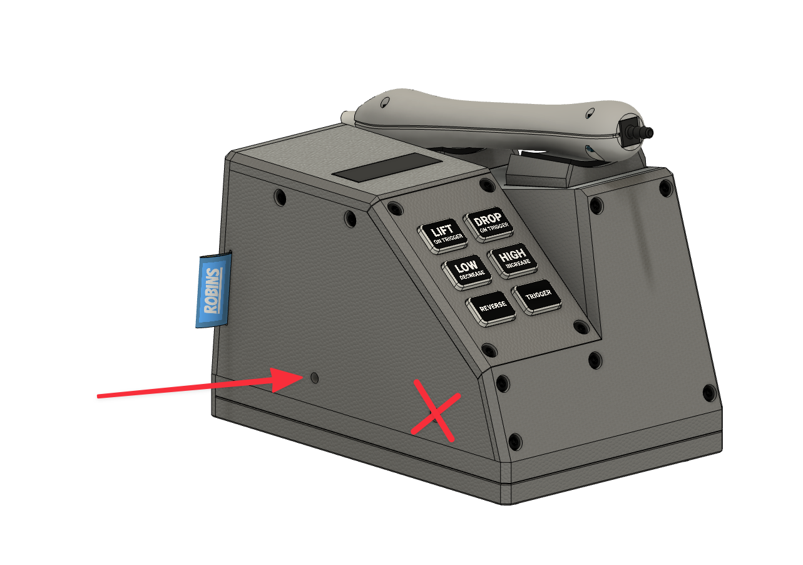

# Pixel Pump Firmware

MicroPython firmware for the Pixel Pump — a vacuum pick-and-place tool for PCB assembly.

It runs on an RP2040 (Raspberry Pi Pico) with MicroPython v1.20. The pump has six illuminated
buttons, three solenoid valves, a PWM-driven vacuum pump and two foot pedal inputs. The firmware is
a small state machine: **Lift**, **Drop** and **Reverse** are the three operating modes, and
long-pressing a button gets you into its settings.

Prebuilt firmware is on the [releases page](https://github.com/robin7331/pixel-pump-firmware/releases).
If you just want a working pump, grab `firmware.uf2` from there and skip to [Flashing](#flashing).

## The two firmware files

Every build produces two UF2 files. The difference matters:

```
firmware.uf2
# Flash this for regular use of the pump.
# It is MicroPython with the Pixel Pump firmware frozen into the image.
# It ignores any main.py you copy onto the device and runs the frozen one instead.

firmware-blank.uf2
# Plain MicroPython, without the Pixel Pump firmware frozen in.
# Flash this to develop: now you can copy your own .py files and have them run on boot.
```

So: `firmware.uf2` to use the pump, `firmware-blank.uf2` to hack on it.

## Flashing

### Entering the bootloader

With a working pump, **long-press Lift** to enter brightness settings, then **long-press Drop**.
All buttons turn white and the pump reboots into the bootloader. Power cycle to get back out.

If the pump isn't running or has no firmware on it, there's a hardware bootloader switch. Looking at
the pump from the front, there are two small holes on the left side — the one towards the back
exposes the switch. Reach in with something thin (one of the nozzles that came with the pump works)
until you feel it click, hold it, and power the pump on.



You can also send `bootloader` over the [serial interface](#serial-commands).

### Copying the UF2

In bootloader mode the pump shows up as a mass storage device. Copy the UF2 onto it and wait for the
reboot. Once it restarts it should no longer appear as a drive — it has left the bootloader.

## Development

Flash `firmware-blank.uf2` first, then use [mpremote](https://docs.micropython.org/en/latest/reference/mpremote.html)
to get your code onto the device.

```bash
uv tool install mpremote   # or: pip3 install mpremote
```

### Mounting your working copy (recommended)

Mounting is the fastest loop — the device runs the files straight off your machine, so there's no
copy step at all. Add this to `~/.config/mpremote/config.py`:

```python
commands = { "debug": ["mount", "./src", "exec", "import main"] }
```

Then from the repo root:

```bash
mpremote debug
```

Edit a file, `Ctrl-C`, run it again. Note that the pump writes its `settings.json` to whatever
filesystem it's running from, so while mounted it lands in `src/` on your machine. That path is
gitignored.

### Copying files instead

If you'd rather have the code live on the device:

```bash
mpremote cp -r src/pixel_pump :        # the whole package
mpremote cp src/main.py :              # and the entry point

mpremote ls                            # see what's on the device
mpremote rm :main.py                   # remove a file
mpremote reset                         # reboot
```

If you have more than one board attached, pick the port explicitly:

```bash
mpremote devs                          # list attached devices
mpremote connect /dev/tty.usbmodem2201 ls
```

### A typical change

Say we want the button LEDs to render at 5 FPS instead of 30, just to see what happens.

The main loop lives at the bottom of `src/pixel_pump/pixel_pump.py` (`src/main.py` is a one-line
import). Find the render throttle and change the delay from **33** ms to **200** ms:

```python
    # Render the UI at 5 FPS.
    if utime.ticks_ms() - rendered_at > 200:
        renderer.flush_frame_buffer()
        rendered_at = utime.ticks_ms()
```

Run `mpremote debug` again and the buttons will animate in visible steps. Congratulations, that's
your first Pixel Pump hack 😈

Flash `firmware.uf2` from the [releases page](https://github.com/robin7331/pixel-pump-firmware/releases)
whenever you want to get back to a known-good pump.

## Serial commands

The firmware polls USB stdin for newline-terminated, colon-separated commands. Open a serial
terminal (`mpremote repl`) and type them — the running firmware consumes stdin, so they reach the
command parser directly.

| Command | Effect |
|---|---|
| `bootloader` | Reboot into the UF2 bootloader |
| `version:info` | Prints `tag,branch,commit_hash,timestamp` |
| `reset:soft` / `reset:hard` | Exit the program / hard reset the MCU |
| `settings:dump` | Print all settings as JSON |
| `settings:persist:<json>` | Overwrite all settings, then hard reset |
| `settings:reset` | Restore defaults, then hard reset |
| `settings:set_brightness:<float>` | Global LED brightness (clamped 0.35–0.8) |
| `settings:set_mode:lift\|drop\|reverse` | Switch operating mode |
| `settings:set_power_mode:high\|low` | Switch power mode |
| `settings:set_low_power_setting:<0-100>` | Low mode motor duty, in percent |
| `settings:set_high_power_setting:<0-100>` | High mode motor duty, in percent |
| `settings:set_secondary_pedal_key:<hex>` | HID keycode sent when the second pedal is tapped |
| `settings:set_secondary_pedal_key_modifier:<hex>` | Modifier for the above |
| `settings:set_secondary_pedal_long_key:<hex>` | HID keycode for a long hold |
| `settings:set_secondary_pedal_long_key_modifier:<hex>` | Modifier for the above |

Keycodes are HID scancodes — see the [scancode table](https://deskthority.net/wiki/Scancode).

## Building

There's no local Makefile. Builds run as GitHub Actions, which you can run on your own machine with
[nektos/act](https://github.com/nektos/act). It uses Docker under the hood, so make sure that's
running.

```bash
brew install act

act -j local-dev-build -b ./build
```

This takes a while — it compiles mpy-cross and the entire rp2 port from source. When it finishes
you'll have `firmware.uf2` and `firmware-blank.uf2`.

Each build applies a patch to MicroPython that adds a `usb_hid` module
(`drivers/rp2_hid/0001-shared-tinyusb-Add-USB-HID-support.patch`), generates `src/pixel_pump/version.py`
from git, and then builds twice — once empty, once with `src/` frozen in via
`boards/PIXEL_PUMP/manifest.py`.

| Workflow | Trigger | Result |
|---|---|---|
| `pixel_pump_dev_local.yml` | push to `dev` | build only — this is the one to run with `act` |
| `pixel_pump_dev.yml` | push / PR to `dev` | draft prerelease tagged `latest` |
| `pixel_pump_main.yml` | `v*` tag | draft release |

## Project layout

```
src/main.py                     Entry point — imports and starts the firmware
src/pixel_pump/
  pixel_pump.py                 Pin setup, object graph, boot sequence, main loop
  pixel_pump_state_machine.py   Holds the hardware and the current state
  states/                       One file per mode (lift, drop, reverse, settings, bootloader)
  controls/                     Button and GPIO event handling
  enums/                        Colors, brightness levels, power modes
  ui_renderer.py                WS2812 driver (PIO) and frame buffer
  motor.py, valve.py            Pump and solenoid control
  keyboard.py                   USB HID keyboard output
  communication_manager.py      Serial command parser
  settings_manager.py           settings.json persistence

boards/PIXEL_PUMP/              MicroPython board definition and freeze manifest
drivers/rp2_hid/                USB HID patch for MicroPython
tools/generateVersionFile.py    Writes version.py from git metadata (runs in CI)
```

There's no test suite and no linter — testing is done by hand, on hardware.

## Contributing

Fork the repo, work the way described above, and open a pull request against `dev`. Development
builds are cut from `dev`; releases are tagged `v*` off `main`.

Happy hacking!
